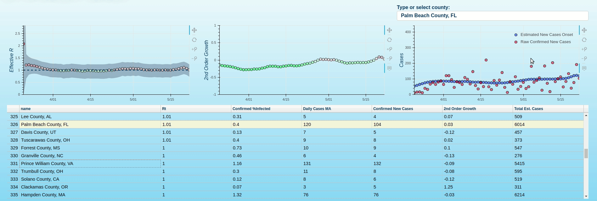
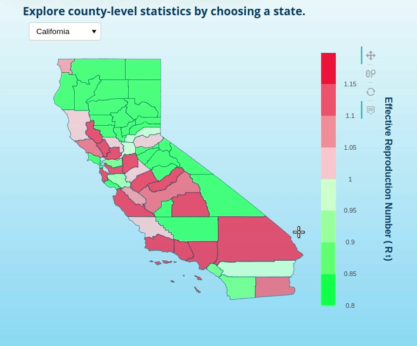
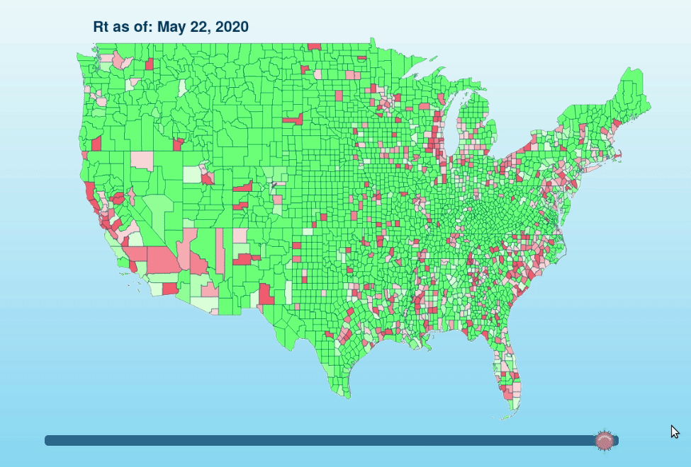

# "Real-Time" Covid19 [County-Level](https://speediedan.github.io/covid19/county_covid_explorer.html) &  [Choropleth](https://speediedan.github.io/covid19/choropleth_covid_county_explorer.html) Dashboards
---
> ### [The "Real-Time" County-Level Dashboard](county_covid_explorer.html):
> * **A "real-time"[1](#daily-onset-estimation) county-level dashboard w/ a focus on estimated effective reproduction number (Rt)[2](#effective-reproduction-number-estimation), 2nd order growth rates and confirmed infection density for most US counties (counties w/ > 0.03% confirmed infection density)**

> ### [The "Real-Time" Choropleth Dashboard](choropleth_covid_county_explorer.html):
> * **State and national choropleths for exploring the geographic distribution of "real-time"[1](#daily-onset-estimation) county-level Rt[2](#effective-reproduction-number-estimation) along with other relevant epidemiological statistics. Due to resource constraints, the national choropleth represents exclusively Rt data while the state choropleths include additional county-level metrics. The national choropleth can currently be temporally evolved over a 14-day horizon.**

> ### [County-Level EDA Notebook](https://github.com/speediedan/covid19/blob/master/covid19_county_level_EDA.ipynb)
> * **Notebook for manual EDA of county-level hotspot data**

### Daily Onset Estimation
* Case reporting latency is avoided by convolving the latest [onset-confirmed latency distribution](https://github.com/beoutbreakprepared/nCoV2019/tree/master/latest_data) onto daily reported cases, then adjusting for right-censoring to obtain the estimated daily onset values.

### Effective Reproduction Number Estimation
   * I've extended [this great notebook](https://github.com/k-sys/covid-19/blob/master/Realtime%20R0.ipynb) to a county-level.
   * Importantly, it should be noted that (as of 2020.05.12) access to testing is continuing to increase and test positivity rates are therefore changing at a [substantial rate](https://www.cdc.gov/coronavirus/2019-ncov/covid-data/covidview/index.html). As the testing bias continues to evolve in the near-term, one should recognize that point Rt estimates will be biased to be higher than ground truth Rt. There are approaches that can [mitigate this bias to a limited extent](http://freerangestats.info/blog/2020/05/09/covid-population-incidence) but fundamentally, we don't have sufficient data to eliminate the bias at this point so I've deprioritized making those model adjustments at the moment (I may make testing-related adjustments in the future though and PRs are welcome!). Fortunately, as testing access and bias stabilize at a level that increases validity of confirmed case counts, these Rt estimates should become increasingly accurate. I think we can expect hotspot monitoring tools such as this to have utility for a number of months, so this initial period of testing volatility does not nullify their value.
   * The most salient change I've made in the process of the extension is that rather than using a prior of gamma-distributed generation intervals to estimate R (which seems totally reasonable), I'm experimenting with incorporating more locally-relevant information by calculating an R0 using initial incidence data from each locality.
   * For execution environments that are compute-constrained, I've also provided (but left disabled) some performance enhancing functions that cut execution time by about 50% at the cost of ~5% accuracy.

### "Real-Time" County-Level Dashboard

### "Real-Time" State Choropleth

### "Real-Time" National Choropleth

### Latest County-Level Grid Plots

* #### Daily Estimated Effective Reproduction Number (Rt) (counties w/ highest total onset cases)
.jpg)
* #### 2nd order case growth (disjoint 4-day windows)

* #### County-level hotspots: cumulative case growth (4-day MA)
.jpg)
* #### County-level hotspots: Estimated Onset Cases

### SEIR Model Notes
* #### At the time the SEIR model component of this notebook was written (2020.03.30) there remained significant uncertainty regarding some sars-cov-2 parameters. The data fit varied substantially by county so I used what I perceived (N.B.: w/ no personal epidemiological expertise!!) to be the consensus values, documented below:

| Parameter   | Source  | Reference Value     |
| :---        | :----:  |     ---:            |
| Latent Period   | [Lin et al., 2020](https://www.ijidonline.com/article/S1201-9712(20)30117-X/fulltext) | 3   |
| Latent Period   | [Wu et al., 2020](https://www.sciencedirect.com/science/article/pii/S0140673620302609) | 3     |
| Latent Period   | [Li et al., 2020](https://www.medrxiv.org/content/10.1101/2020.03.06.20031880v1.full.pdf) | 2 |
| Serial Interval | [Nishura et al. 2020](https://www.ijidonline.com/article/S1201-9712(20)30119-3/pdf) | 4.6 |
| Serial Interval | [Li et al., 2020](https://www.nejm.org/doi/pdf/10.1056/NEJMoa2001316?articleTools=true) | 7.5 |
| Incubation Period | [Li et al., 2020](https://www.nejm.org/doi/pdf/10.1056/NEJMoa2001316?articleTools=true) | 5.2 |
| Infectious Period | [Li et al., 2020](https://www.nejm.org/doi/pdf/10.1056/NEJMoa2001316?articleTools=true) | 2.3 |
| Infectious Period | [Zhou et al., 2020](https://www.medrxiv.org/content/10.1101/2020.02.24.20026773v1.full.pdf) | 6 |
| Infectious Period | [Bi et al., 2020](https://www.medrxiv.org/content/10.1101/2020.03.03.20028423v3) | 1.5
| Infectious Period | [Kucharski et al., 2020](https://cmmid.github.io/topics/covid19/current-patterns-transmission/wuhan-early-dynamics.html) | 2.9
| Time to Hospitalization | [Huang et al., 2020](https://www.thelancet.com/journals/lancet/article/PIIS0140-6736(20)30183-5/fulltext) | 8
| Mean Hospitalization Period | [Wang et al., 2020](https://jamanetwork.com/journals/jama/fullarticle/2761044?guestAccessKey=f61bd430-07d8-4b86-a749-bec05bfffb65) | 12
| Hospitalization Rate | [Ferguson et al., 2020](https://spiral.imperial.ac.uk/bitstream/10044/1/77482/5/Imperial%20College%20COVID19%20NPI%20modelling%2016-03-2020.pdf) (weighted by us demo by [Covid Act Now](https://covidactnow.org/model)) | 0.073

## Contributing

>  Thoughts or contributions welcome!

## License

- **[MIT license](http://opensource.org/licenses/mit-license.php)**