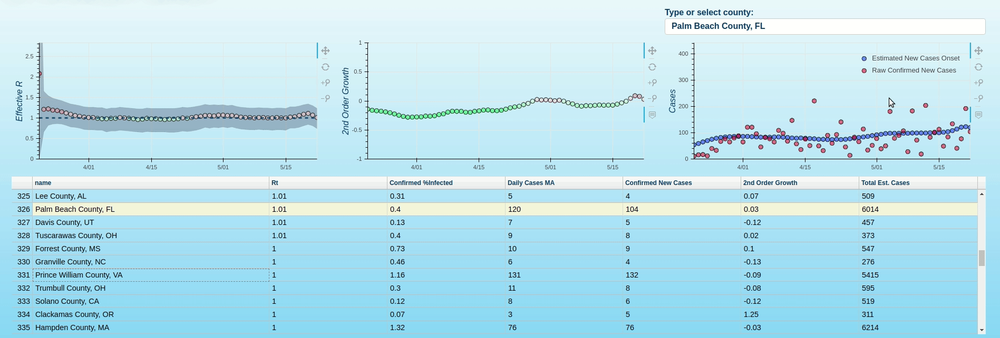
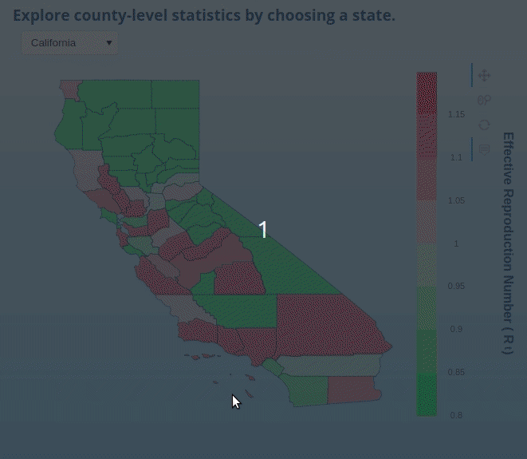
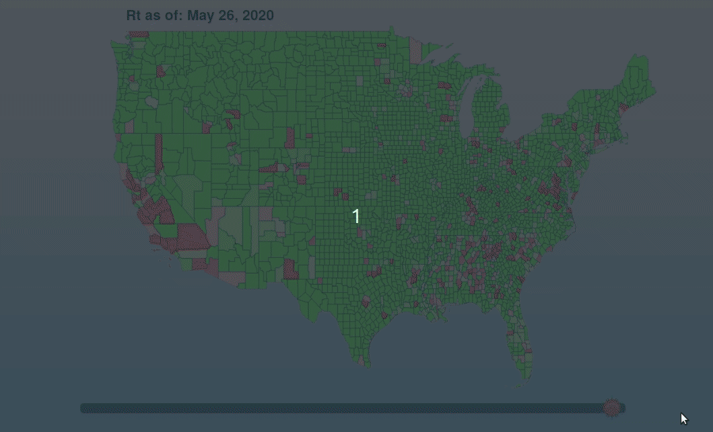

> ### [The "Real-Time" County-Level Dashboard](county_covid_explorer.html):
> * **A "real-time"[1](#daily-onset-estimation) county-level dashboard w/ a focus on estimated effective reproduction number (Rt)[2](#effective-reproduction-number-estimation), 2nd order growth rates and confirmed infection density for most US counties (counties w/ > 0.03% confirmed infection density)**

> ### [The "Real-Time" Choropleth Dashboard](choropleth_covid_county_explorer.html):
> * **State and national choropleths for exploring the geographic distribution of "real-time"[1](#daily-onset-estimation) county-level Rt[2](#effective-reproduction-number-estimation) along with other relevant epidemiological statistics. Due to resource constraints, the national choropleth represents exclusively Rt data while the state choropleths include additional county-level metrics. The national choropleth can currently be temporally evolved over a 14-day horizon.**

> ### [County-Level EDA Notebook](https://github.com/speediedan/covid19/blob/master/covid19_county_level_EDA.ipynb)
> * **Notebook for manual EDA of county-level hotspot data**

### Daily Onset Estimation
* Case reporting latency is avoided by convolving the latest [onset-confirmed latency distribution](https://github.com/beoutbreakprepared/nCoV2019/tree/master/latest_data) onto daily reported cases, then adjusting for right-censoring to obtain the estimated daily onset values.

### Effective Reproduction Number Estimation
   * I've extended [this great notebook](https://github.com/k-sys/covid-19/blob/master/Realtime%20R0.ipynb) to a county-level. 
   * Importantly, it should be noted that (as of 2020.05.12) access to testing is continuing to increase and test-positivity rates are therefore changing at a [substantial rate](https://www.cdc.gov/coronavirus/2019-ncov/covid-data/covidview/index.html). As the testing bias continues to evolve in the near-term, one should recognize that point Rt estimates will be biased to be higher than ground truth Rt. There are approaches that can [mitigate this bias to a limited extent](http://freerangestats.info/blog/2020/05/09/covid-population-incidence) but fundamentally, we don't have sufficient data to eliminate the bias at this point so I've deprioritized making those model adjustments at the moment (I may make testing-related adjustments in the future though and PRs are welcome!). Fortunately, as testing access and bias stabilize at a level that increases validity of confirmed case counts, these Rt estimates should become increasingly accurate. I think we can expect hotspot monitoring tools such as this to have utility for a number of months, so this initial period of testing volatility does not nullify their value.
   * The most salient change I've made in the process of the extension is that rather than using a prior of gamma-distributed generation intervals to estimate R (which seems totally reasonable), I'm experimenting with incorporating more locally-relevant information by calculating an R0 using initial incidence data from each locality.
   * For execution environments that are compute-constrained, I've also provided (but left disabled) some performance enhancing functions that cut execution time by about 50% at the cost of ~5% accuracy.
   
### "Real-Time" County-Level Dashboard

### "Real-Time" State Choropleth

### "Real-Time" National Choropleth

## Contributing

>  Thoughts or contributions welcome!

## License

- **[MIT license](http://opensource.org/licenses/mit-license.php)**
